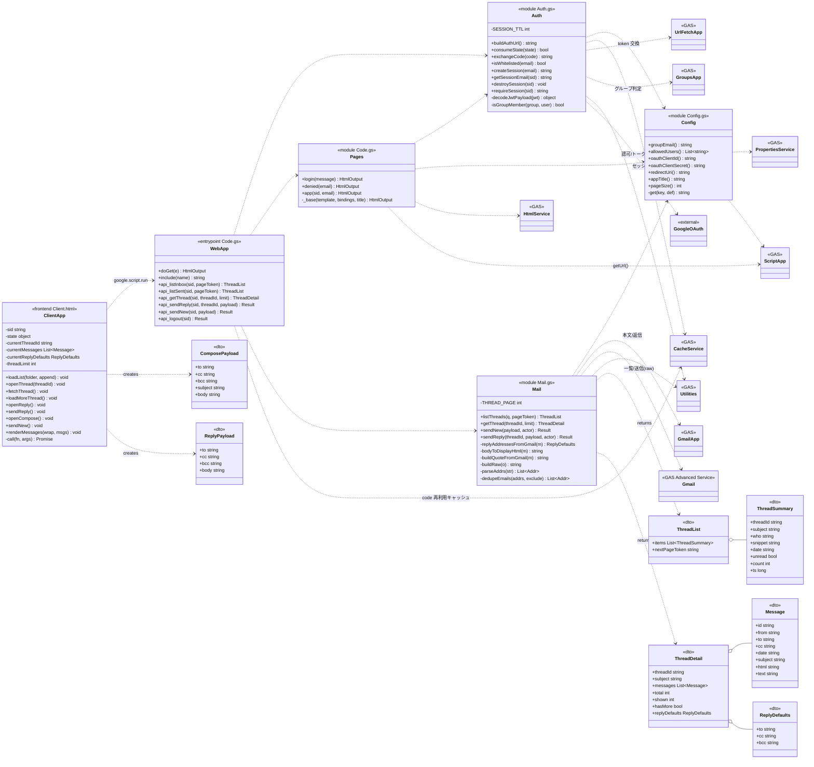

# クラス図（UML）

団体メーラー (Gmailer) の構成を UML クラス図で示します。
Google Apps Script のモジュール（IIFE パターン）を「クラス」、利用する GAS サービス・
受け渡しデータ（DTO）・フロントエンドを併記しています。

- `<<entrypoint>>` … Web アプリのエントリ／API（`Code.gs`）
- `<<module>>` … サーバーロジック（`*.gs` の IIFE）
- `<<frontend>>` … ブラウザ側 JS（`Client.html`）
- `<<dto>>` … API でやり取りするプレーンオブジェクト
- `<<GAS>>` / `<<external>>` … プラットフォーム提供サービス／外部

## 補足

- **実行権限の分離**: `Mail` / `Pages`（`ScriptApp.getUrl`）はオーナー（団体アカウント）権限で動作。
  `Auth` はアクセス者の本人確認（OAuth）にのみ関与し、`GoogleOAuth`（`accounts.google.com`）と通信する。
- **セッション**: `Auth` がセッションIDを `CacheService` に保持。`WebApp.api_*` は各呼び出しで
  `Auth.requireSession(sid)` を通す。
- **読み取り/送信の使い分け**: 一覧は `Gmail`（高度なサービス・メタデータ）で軽量取得、本文は
  `GmailApp`（`getBody`/`getPlainBody`）で確実に復号、送信・返信は `Gmail.Users.Messages.send`
  （`raw` + `threadId`）で団体アカウントとして送信。
- **HTML（ビュー）**: `Index.html` / `Login.html` / `Styles.html` / `Client.html` は
  `HtmlService` テンプレートとして `Pages` から評価される（クラス図では `ClientApp` に集約）。
